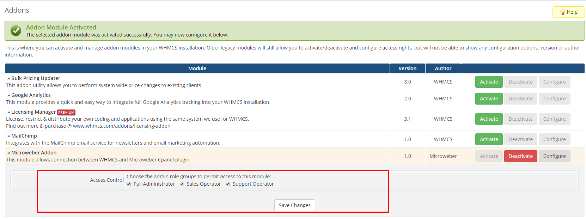
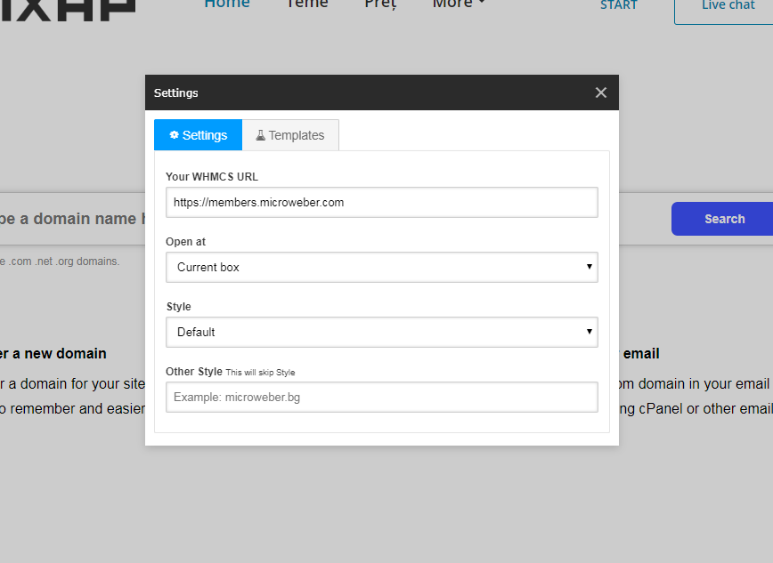

# Microweber WHMCS Plugin

## How to install WHMCS Plugin?

1. Upload files from this repo in whmcs **MAIN DIR**
2. Activate the **Microweber Addon** from **Setup > Addon modules**
3. Go to **general settings** and set **Domain Url** and **WHMCS System URL** as **https**
4. Add configurable option group **"Template"**
5. Go to **Addon > Microweber Addon**
6. Mark current **Plans and Templates**
7. Save!

## Add plugin access for users 

## Download the white-label template for your Microweber site 

1. Download Microweber White Label Template from https://github.com/microwebertemplates/whitelabel
2. Upload the content of zip in /public_html/userfiles/templates/whitelabel/ . You must to create the directory “whitelabel”.
3. Open your main site URL and proceed to install as you need to select SQLite DB, Microweber White Label Template and Install Default content
4. Set WHMCS url on your  website

