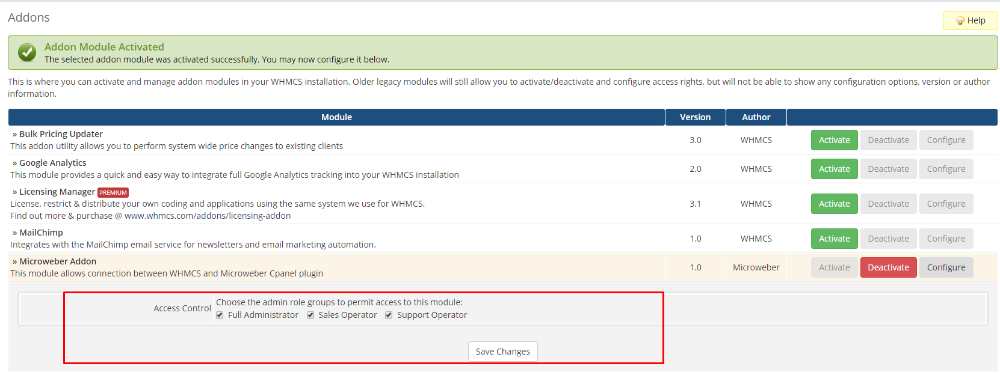
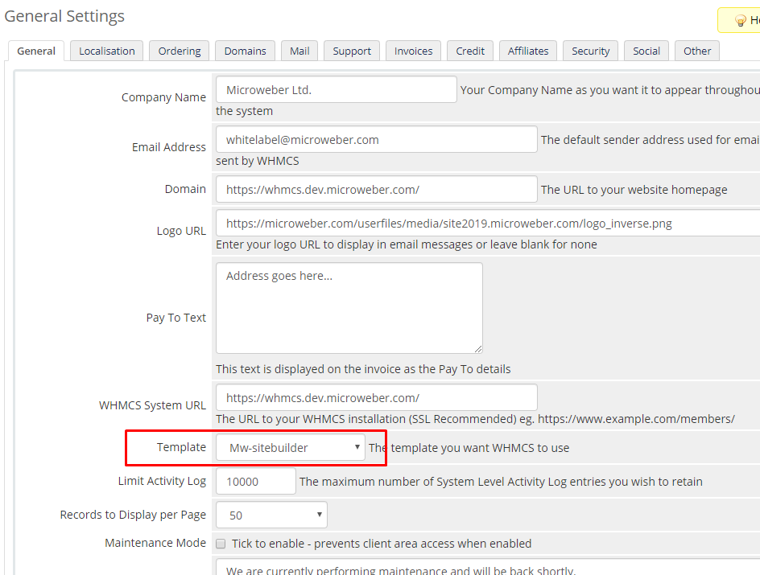

# Microweber WHMCS Plugin

## How to install WHMCS Plugin?

1. Upload files from this repo in whmcs **MAIN DIR**
2. Activate the **Microweber Addon** from **Setup > Addon modules**
3. Go to **general settings** and set **Domain Url** and **WHMCS System URL** as **https**
4. Add configurable option group **"Template"**
5. Go to **Addon > Microweber Addon**
6. Mark current **Plans and Templates**
7. Save!


## Add plugin access for users 




## Set the template 

1. Go to Setup -> General Settings
2. Set the template to "Mw-sitebuilder"
3. Visit your website





# Setup your server

* If you have __*cPanel & WHM*__ you can install the plugin from here [cPanel Plugin](https://github.com/microweber-dev/cpanel-plugin)
* If you have __*Plesk*__ you can install the plugin from here [Plesk Plugin](https://github.com/microweber-dev/plesk-plugin) 
* If you don't have cPanel or Plesk you can use the Cloud Connect setup from here [Cloud Connect](./modules/servers/microweber_cloudconnect/README.md) 


## How to edit the order process

If you wish to edit the order process and customize the designs, you can do it in the following way,

1. All order forms are located in `modules/addons/microweber_addon/order/` folder
2. Copy the folder `whitelabel` and rename it to something else for example `mybrand`
3. Open the file `templates/mw-sitebuilder/header.tpl` and change the embed code parameter of the style attribute for. For example `<script src="{$WEB_ROOT}/modules/addons/microweber_addon/order/embed.js?style=whitelabel&target=top"></script>` will become  or example `<script src="{$WEB_ROOT}/modules/addons/microweber_addon/order/embed.js?style=mybrand&target=top"></script>`
4. Edit your text and style on your order forms from the folder `modules/addons/microweber_addon/order/mybrand`

## To use template selector on your custom cart orderforms


If you wish to edit use your own cart template you need to add thole lines on your file `configureproduct.tpl`

For example open this file `/members/templates/orderforms/modern/configureproduct.tpl` and add


```
{if $template_config_option_script}
{$template_config_option_script}
{/if}
```

     


# Troubleshooting 

If you have any problems please post them in the issues section. 