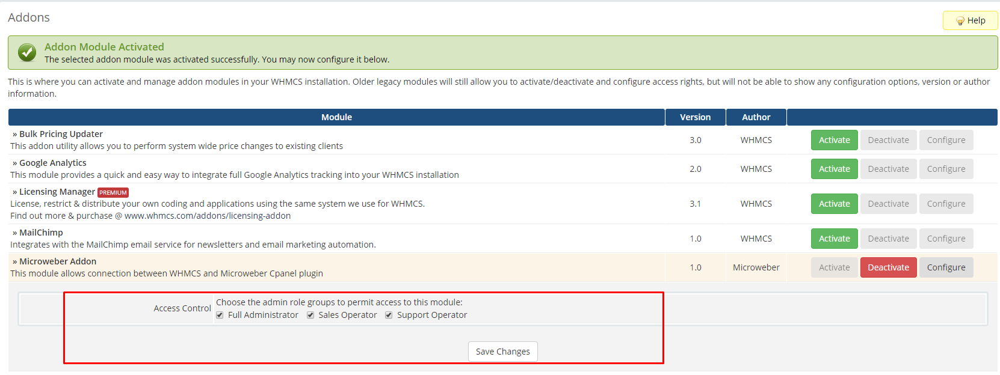

# Microweber WHMCS Plugin

## How to install WHMCS Plugin?

1. Upload files from this repo in whmcs dir **/modules/addons/microweber_addon**
2. Activate the **Microweber Addon** from **Setup > Addon modules**
3. Go to **general settings** and set **Domain Url** and **WHMCS System URL** as **https**
4. Add configurable option group **"Template"**
5. Go to **Addon > Microweber Addon**
6. Mark current **Plans and Templates**
7. Save!

## Add plugin access for users 

