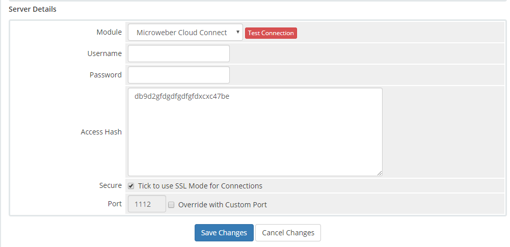
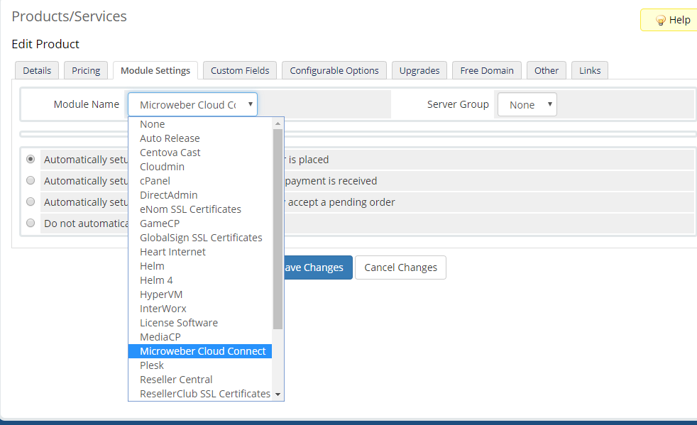

# WHMCS Cloud Connect

1. Go to `Setup -> Product Services -> Servers` and add new server  
2. On hostname enter the hostname of your Microweber server provider. For example: `members.microweber.com`   
3. In `Server Details` select `Microweber Cloud Connect` as a server type

4. Enter you access hash and click "Test Connection"
5. Go to your `Setup -> Product Services` and Add or edit plan. From the plan module choose `Microweber Cloud Connect` from the Module Settings  

  

    